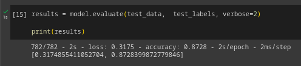

# IMDB-Review-Classifier
A basic text classification app in React and Flask.

**Description**

 This is a web application project that consumes an AI model, built with the Keras library, for binary classification of movie reviews using an IMDb dataset.

 NOTE: 'model-space' folder used to train the model. The model is a 'Sequential' for classification with an Embedding layer, a GlobalAvaragePooling1D layer, a Dense layer with ReLU activation and a Dense layer with sigmoid activation. Total params: 160289.

**Screenshots**

- accurancy: 87.28%
