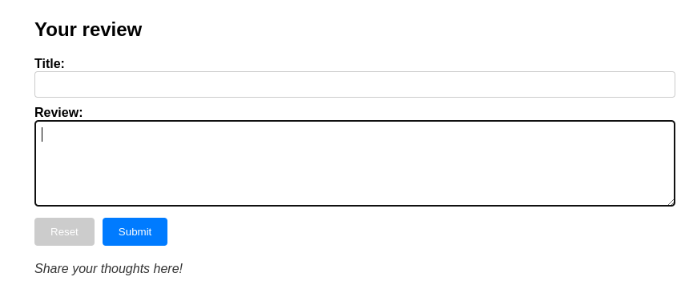
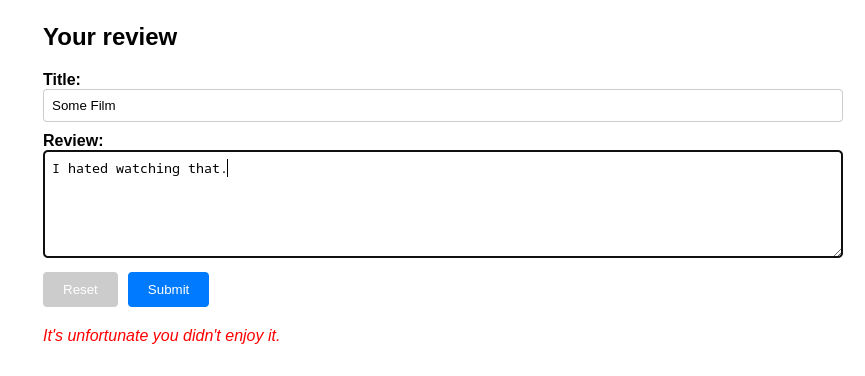
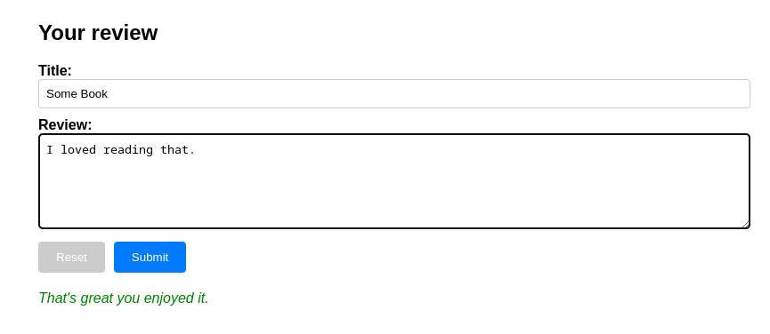

# Review-Classifier
A basic text classification app in JS Vanilla and Flask.

**Description**

 This is a web application project that consumes an AI model, built with the Keras library, for binary classification of movie reviews using an IMDb dataset.

 NOTE: The model is a 'Sequential' for classification with an Embedding layer, a GlobalAvaragePooling1D layer, a Dense layer with ReLU activation and a Dense layer with sigmoid activation. Total params: 320289.

**Installation instructions**

**System requirements**

* Python 3.x
* Node.js 20.x
* NPM 10.x

**Frontend application installation**

1. Enter the frontend application folder
2. Run `npm install` to install dependencies
3. Run `npm run dev` to launch the application in development mode

**API installation**

1. Enter the backend application folder
2. Run `pip install -r requirements` command to install dependencies
3. Run `flask run` to run development mode

**Docker Compose**

If you have Docker installed, you can also run the project using Docker Compose.

1. Navigate to the project directory where the `docker-compose.yml` file is located

2. Run `docker-compose up --build` command to build and start the containers

**Screenshots**

- accurancy: 87.28%

- main screen

- negative example

- positive example

